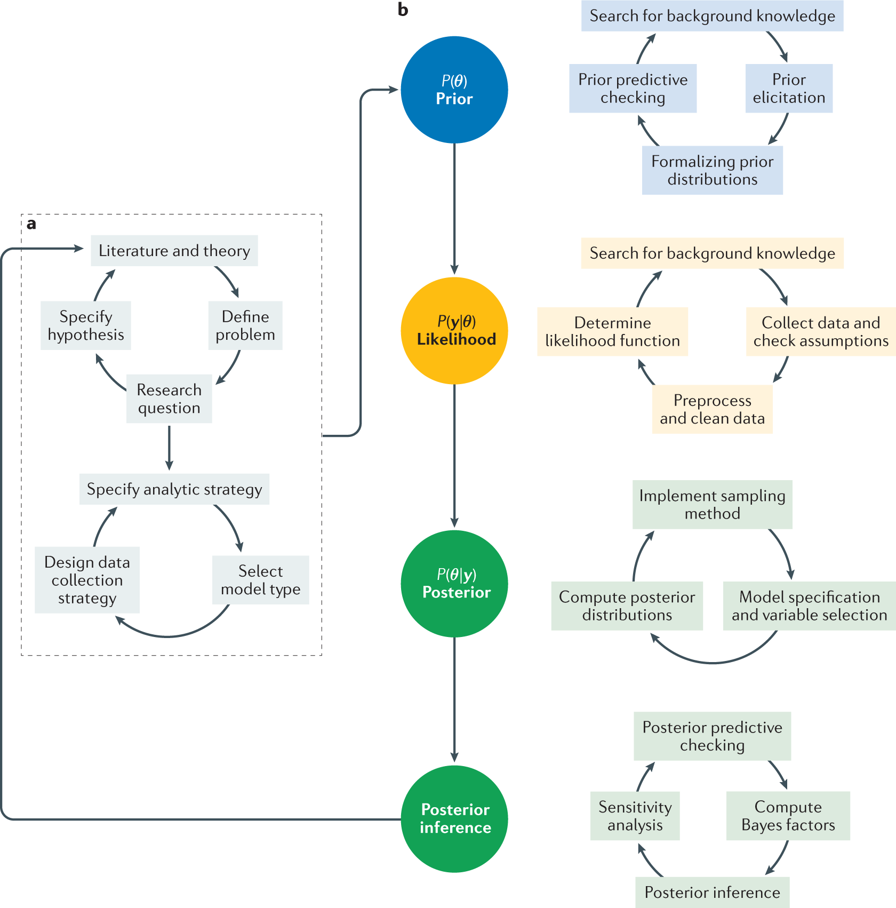

```{r setup, include=FALSE}
knitr::opts_chunk$set(echo = FALSE)

```
One approach that would allow the incorporation of individual information is Bayesian statistics. 

Bayesian statistics is based on probabilistic modeling, i.e. it uses probabilities as a tool to quantify uncertainty. 

Unique to Bayesian statistics, all observed and unobserved parameters in a statistical model are given a joint distribution which are called prior and data distributions [@van2021bayesian]. A typical Bayesian workflow have three main aspects: 

1. capturing pre-existing knowledge about a given parameter in a statistical model via the formulation of *prior distribution*. 
2. determining the *likelihood function* of the parameters using the observed data. 
3. combining both the *prior distribution* and the *likelihood function* using Bayes' theorem in the form of the *posterior distribution*. 

Bayesian workflow [@van2021bayesian]

```{r}
# All defaults
library(knitr)

```

Hierarchical Bayesian Model 

- It is a multi-level Bayesian modeling which enables us to make scientific inferences about a population based on many individuals (or observations).

- It allows the incorporation of the pathway information as a 'grouping' mechanism in the model hierarchy. 

- It allows the incorporation of each unique individual as a 'grouping' mechanism in the model hierarchy. 
  - In other words, we would be able to include clinical/metabolomics information down to an individual level such as different immune responses to COVID-19, which translates to different starting point, disease trajectory, recovery time etc, in the model. 


Hierarchical Bayesian - parameter flow [@taboga2017hierbayes]

```{r out.width = "70%"}
library(knitr)

```

The original Bayes theorem: 

\[p\left(\theta\mid x\right)\propto p\left(x\mid\theta\right) 
  (\#eq:bayes) 
\]

The hierarchical Bayes theorem: 

\[
p\left(\alpha,\theta\mid x\right)\propto p\left(x\mid\theta,\alpha\right)p\left(\alpha\right)
(\#eq:hierbayes)
\]

($\propto$ = proportional to) 

Given the observed data *x*, in a hierarchical Bayesian model, the likelihood depends on two parameter vectors $\theta$ and $\alpha$ \[p\left(x\mid\theta,\alpha\right)\]

and the prior

\[
p\left(\alpha,\theta\right)=p\left(\theta\mid\alpha\right)p\left(\alpha\right)
\]

is specified by separately specifying the conditional distribution $p\left(\theta\mid\alpha\right)$ and the distribution $p\left(\alpha\right)$

In this special case, the parameter $\alpha$ is called hyper-parameter and the prior $p\left(\alpha\right)$ is called hyper-prior.


A Schematic Illustration of Hierarchical Bayesian Modeling [@anh2016hBayesDM]

```{r out.width = "80%"}
library(knitr)

```

Illustration with dummy data

Dummy scenario: 

A metabolite concentration level was obtained from 260 individuals from various ethnic backgrounds. The sample collection was done in 10 different hospitals. These hospitals are scattered over different locations. Each hospital is considered as a representative of the surrounding suburbs where it is located. It is hypothesized that the metabolites concentration level is influenced by ethnicity and the environment factor (socio-economy status, diet, lifestyle etc). For illustration purpose, location is considered as a good indicator of the environment factor. 


